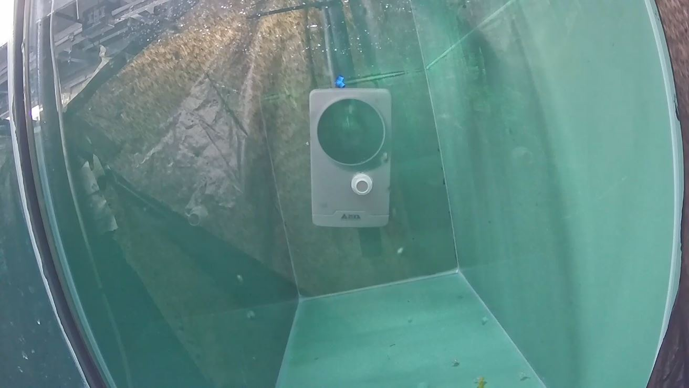
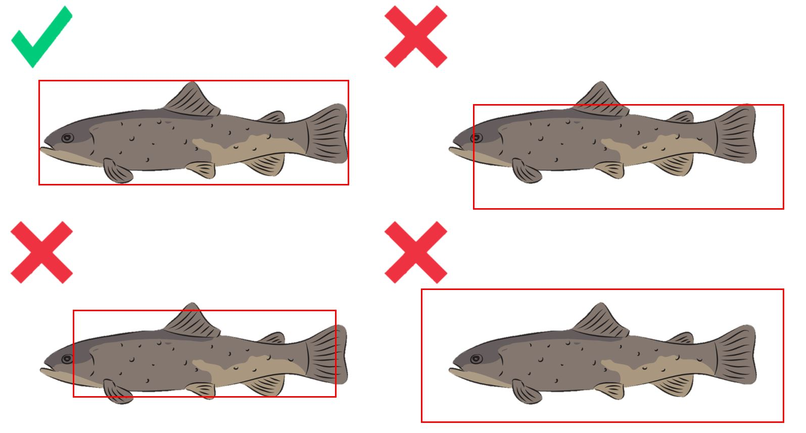

<!-- README.md is generated from README.Rmd. Please edit that file -->

#  AnimalTrackR

`AnimalTrackR` provides a simple interface to
[YOLO11](https://docs.ultralytics.com/) to allow users to train animal
detection models to aid large scale behavioural analyses of single
animals in confined spaces.

*The package is still in development and many features are not yet
available.*

## Installation

You can install the development version of `AnimalTrackR` like so (you
will need the devtools package installed):

``` r
devtools::install_github("mariolambrette/AnimalTrackR")

library(AnimalTrackR)
```

Installation via `install.packages()` is not yet possible, but support
for this method will be added in due course.

### Dependencies

`AnimalTrackR` has multiple external dependencies, including python
libraries and FFmpeg. For the vast majority of users the built-in
`create_TrackR_condaenv()` function will handle all dependencies,
however for users where this is not the case see the DEPENDENCIES
DOCUMENTATION (vignette with description of all dependencies)

## Quick start guide

1.  Install AnimalTrackR.
2.  Create a suitable conda environment.
3.  Initialise a project.
4.  Extract training images from experimental footage.
5.  Annotate images.
6.  Run model training and validate performance.
7.  Deploy models.

``` r

# 1. Install AnimalTrackR
devtools::install_github("mariolambrette/AnimalTrackR")
library(AnimalTrackR)

# 2. Create a suitable conda environment
create_TrackR_env()

# 3. Initialise a project
init_Project(path = "path/to/AnimalTrackR-projects/PROJECT-NAME")

# 4. Extract training images from experimental footage
extract_images(
 videos = list(
   Group1 = list(
     "video1.mp4",
     "video2.mp4",
     "video3.mp4"
   ),
   Group2 = list(
     "video4.mp4",
     "video5.mp4",
     "video6.mp4"
   )
 ),
 group_weights = list(
   Group1 = 0.3,
   Group2 = 0.7
 ),
 nimgs = 1600
)

# 5. Annotate images - https://www.makesense.ai/
save_annotations(csv = "path/to/Annotations.csv")

### IN DEVELOPMENT ###
# 6. Run model training and validate performance
# 7. Deploy models
```

## Intructions

### Overview

`AnimalTrackR` provides an end-to-end pipeline for using [YOLO11
detection models](https://docs.ultralytics.com/tasks/detect/) to track
an individual animal in captivity for behavioural analyses. Broadly, it
allows you to [sample frames](#extracting-training-images) from the
total of your experiment’s footage which you can
[annotate](#image-annotation) and use to [train a YOLOv8 detection
model](#model-training). You can [run](#model-deployment) the model on
short example videos for display and validation, or in batch on very
large video datasets to enable subsequent analyses.

#### File Structure

`AnimalTrackR` uses a specific file structure to support working on
multiple projects and allow seamless integration with standard YOLO
development pipelines. The structure is as follows:

    .
    └── AnimalTrackR-projects
        ├── Project1
        │   ├── ToAnnotate
        │   └── YOLO
        │       ├── Train
        │       │   ├── labels
        │       │   │   └── .txt annotation files corresponding to the images in the images/ directory
        │       │   └── images
        │       │       └── .jpg images ready for model training
        │       ├── Test
        │       │   ├── labels
        │       │   └── images
        │       ├── Val
        │       │   ├── labels
        │       │   └── images
        │       ├── configs
        │       │   ├── model1.yaml 
        │       │   │   └── model training configuration files, there will be one for each model in the models/ directory
        │       │   └── model2.yaml
        │       └── models
        │           ├── model1/
        │           │   └── Files containing model training info and model weights. 
        │           └── model2/
        └── Project2
            └── ...

\*Most users will never need to interact directly with the majority of
this file structure, it is created and managed by helper functions
provided in `AnimalTrackR`\*\*

### First Usage:

`AnimalTrackR` relies on python to execute image processing tasks.
Specifically, it uses a python 3.11 conda environment. When you first
install the package you will need to run the following command to create
the environment:

``` r

library(AnimalTrackR)

create_TrackR_env()
```

This relies on you having miniconda installed on your machine. If you do
not have a miniconda installation, the function will prompt you to
install it. Selecting yes will call `reticulate::install_miniconda()`
internally and handle the installation process. Users who would prefer
to manually install miniconda can decline the prompt and proceed to
install miniconda themselves.

These steps are only required the first time you use AnimalTrackR. The
correct environment is now set up and will be made available to your R
session with any subsequent usage of `library(AnimalTrackR)`.

See the [function documentation](man/create_TrackR_condaenv.Rd) for more
information on custom environments.

#### A note on GPUs

The YOLO models on which AnimalTrackR relies are designed to run on
[GPUs](https://en.wikipedia.org/wiki/Graphics_processing_unit). While
they will still run on a standard computer with a CPU they will be
significantly faster (10-50x) on a properly configured GPU. Currently
YOLO models only support CUDA-compatible GPUs. If you have one in your
system you can configure the `AnimalTrackR` environment to use it by
adding your specific CUDA version to the call to
`create_TrackR_condaenv()` as follows:

``` r

library(AnimalTrackR)

# Create a CUDA enabled conda environment for cuda version 12.1
create_TrackR_env(cuda.version = 12.1)

# Check that the environment was created correctly and that the GPU is accessible
check_gpu() # This should return TRUE
```

If you have CUDA but do not know what version you have you can open a
command prompt and enter

``` bash
nvidia-smi
```

The first line of the result will give you your CUDA version.

If you do not have a GPU, or none of this makes sense to you, do not
worry. The models will still run on a standard laptop, they will just
take a bit longer. If you need any support with setting up your system,
or have any other questions regarding these issues please do not
hesitate to contact us: <ml673@exeter.ac.uk>

### Starting a project

Next, you need to initiate an AnimalTrackR project, contained within a
directory that has a [specific structure](#file-structure) to support
the image annotation process and allow for integration with YOLO
development pipelines. Use the `init_Project()` function by providing
the path to the project root directory. Providing just a project name
(as in the example below) will create a project folder with that name in
the current working directory.

``` r

init_Project(path = 'MyProject')
```

### Extracting training images

The first step in model development is to extract still images from
experimental footage. This requires careful consideration of your
footage and experimental design. Training images should accurately
reflect variability in your experimental data. For some experiments with
very little variability between recordings this may be very
straightforward, but for more complex experiments/datasets with variable
backgrounds it may be a more complex process.

The basic premise for this step is to create a stratified sample with
the different experimental groups. `extract_images()`(described in
detail below) takes a named list as an input. This list’s structure is
as follows, where each group contains recordings that are related in
appearance and experimental group:

``` r

video_files <- list(
  Group1 = list(
    "video1.mp4",
    "video2.mp4",
    "video3.mp4",
    ...
  ),
  Group2 = list(
    "video4.mp4",
    "video5.mp4",
    "video6.mp4",
    ...
  ),
  ...
)
```

When setting nested list up consider your experimental design carefully.
Ideally, your footage is divided into folders rouhgly based on
experimental groups, and as such separating groups is straightforward
and should always be done. If your file structure is more complex it may
be tempting to ignore some of the experimental groupings and samples
frames from the whole dataset. This is not always an issue but should be
done with caution. If your footage is **visually consistent** between
groups (i.e. always the same species, background, obstacles etc.) then
you probably do not need to worry about stratification. However, if you
have footage where there are significant visual differences you should
stratify the input above properly to reflect this variability for
optimal model performance. You may also need to experiment with
different stratifications here if you find consistently poor performance
in a specific experimental group. If you have any issues with step do
not hesitate to contact us for help at <ml673@exeter.ac.uk>.

`extract_images()` also takes another list as an argument which defines
the weights to apply to each group when performing a stratified sample.
This argument is optional, by default the function will use the relative
numbers of videos in each group to calculate the weights to apply,
however there may be instances where users want to change this. This
list should be of the same structure as the `video_files` list:

``` r

group_weights <- list(
  Group1 = 0.4,
  Group2 = 0.6
)
```

The sum of the weights supplied must be equal to 1 and the names of the
groups must be the same in these two lists or `extract_images()` will
throw an error.

Run `extract_images()` as follows:

``` r

extract_images(
  videos = video_files,
  group_weights = group_weights,
  nimgs = 1600
)
```

`nimgs` defines the total number of images that will be exported. The
default number (1600) will provide around 1000 training images and 300
images each for testing and validation. In many cases this will be
sufficient to train effective models, but more complex experimental
scenes may require a larger number of training images, particularly if
the backgrounds employed are highly variable. The recommendation is to
start with the default number and start training detection models, then
add further images if model performance is poor.

`extract_images()` will populate the ‘/ToAnnotate’ folder in the project
directory with ’\*.jpg’ files extracted from experimental footage.

### Image annotation

You are now ready to start annotating training images. In principle, you
are free to use any image annotation software you prefer. However, these
instructions will focus on using the free online tool [Make
Sense](https://www.makesense.ai/). Navigate to the link and press the
‘Get Started’ button in the bottom right corner of the screen.

You will be presented with a box into which you can upload images to
annotate:

<div style="text-align: center; margin-top: 20px; margin-bottom: 30px;">


</div>

Click the box to select files and navigate to the ‘/ToAnnotate’ folder
in your project directory. Click and drag the whole folder into the box
on the screen and wait for the images to be loaded, then click the
object detection button.

You will now be presented with an an option to create labels. You should
click the ‘Load Labels from File’ button and navigate to your project
folder. From the project root directory go to YOLO/configs and select
the ‘labels.txt’ file. You will see a message saying three labels have
been found.

<div style="text-align: center; margin-top: 20px; margin-bottom: 30px;">


</div>

The three labels are as follows:

- **Target**: The target object in the frame (i.e. the animal you would
  like to track).
- **ZZZ**: Any non-target objects in the frame that are visually similar
  to the target object (more details below).
- **Empty**: Use this label on a randomly placed bounding box in any
  frames that do not contain the target animal (more details below).

***Non-target objects***

Take the below image:

<div style="text-align: center; margin-top: 20px; margin-bottom: 30px;">


</div>

The target animal is on the right but there is another almost identical
animal on the left. This image should be labelled as follows:

<div style="text-align: center; margin-top: 20px; margin-bottom: 30px;">


</div>

The target fish is annotated with the ‘Target’ label, while the
non-target is annotated with the ‘ZZZ’ label. During training this will
allow the model to learn how to distinguish between target and
non-target objects in the frame based on factors such as relative
position and size. It is crucial that non-target objects are annotated
in this manner, not annotating them could have significant deleterious
effects on model performance.

Not all datasets will have this problem, and if that is the case in your
data you can simply ignore the ‘ZZZ’ label.

*Note that this type of more complex dataset may require a greater
number of annotated training images for optimal model performance.*

***Empty frames***

The below image contains no target objects:

<div style="text-align: center; margin-top: 20px; margin-bottom: 30px;">



</div>

It should be labelled as follows:

<div style="text-align: center; margin-top: 20px; margin-bottom: 30px;">


</div>

This ensures that a representative number of empty frames are added to
the model training data (the bounding boxes themselves will be deleted
at a later stage so its location/size are not important). Empty frames
are important in training as they reduce the instance of false positive
detections during model deployment, though if you are certain your
footage contains no emtpy frames you do not need to worry about this.

***Annotation guidelines***

There are a few basic principles to follow when annotating your images:

1.  Annotate every object of interest in the frame.
    - Every frame that contains a target object (or a non-target but
      visually similar object) must be annotated. YOLO models use all
      non-annotated space on the frame as a ‘negative’ so by not
      annotating a target object you will train the model to not
      recognise it.
2.  Fit bounding boxes as tightly as possible around target objects.
    - Bounding boxes should fully surround the target object but include
      minimal space around it. See the images below:
      <div style="text-align: center; margin-top: 20px; margin-bottom: 30px; margin-left: 20px;">

      

      </div>
3.  Be consistent with class labels.
    - The target and non-target class labels need to be absolutely
      consistent across all of your training images (case sensitive). If
      you never edit the ‘labels.txt’ file this should not be a problem.
4.  Label empty frames.
    - Draw a random box on the frame (its location/size is not
      important) and label it ‘empty’. This is to ensure that during
      later steps empty images are exported alongside other annotated
      images for training. Including empty images if they occur in your
      dataset is critical so that the model learns that empty images can
      occur.

Work your way through the uploaded images. At the end of your annotating
session click the ‘Actions’ button in the top left corner of the screen
and select the ‘Export Annotations’ option. You will be presented with
the following dialog box:

<div style="text-align: center; margin-top: 20px; margin-bottom: 30px;">


</div>

Select the ‘Single CSV file’ option and click export. A csv file will be
downloaded with the following columns:

- **label_name:** The class name of the bounding box
- **bbox_x:** The x coordinate of the centre of the bounding box
- **bbox_y:** The y coordinate of the centre of the bounding box
- **bbox_width:** The width of the bounding box
- **bbox_height:** The height of the bounding box
- **image_name:** The filename of the image
- **image_width:** The width of the image
- **image_height:** The height of the image

*Note that all units are in pixels and, as is the default in computer
vision, the origin for coordinates is the top left corner of the image*

If you have used a different annotation tool, or have pre-existing
annotations you will need to convert the annotations into this csv
format and make sure the images are in the ‘ToAnnotate’ folder and that
the image file names match the ‘image_name’ column.

***Saving annotations***

After downloading the csv file you need to save and reformat your
annotations so they are ready for model training. Save the csv file in
an accessible location and go back to your R session. Ensure that the
correct TrackR project is active using `get_Project()`. If not, activate
the correct project with `set_Project()`

``` r

library(AnimalTrackR)

get_Project()
```

Next, use the `save_annotations()` function to convert and save your
annotations.

``` r

save_annotations(csv = "path/to/csv/file")
```

This will convert the csv file of annotations into the [YOLO
format](https://docs.ultralytics.com/datasets/detect/) and save them
into the ‘/YOLO’ directory in your project folder. Images will be
randomly split into training, testing and validation sets with 60%, 20%,
20% weighting. The function will also remove images that have been
annotated from the ‘/ToAnnotate’ directory. This means that in your next
annotation session you can load the folder onto MakeSense as described
above without a risk of duplicate annotations.

**NOTE:** We are working on building an annotation tool within the
AnimalTrackR package that will make this process significantly easier,
if this is something you would like to see please do let us know at
<ml673@exeter.ac.uk>.

### Model Training

***A note on GPUs***

Running models on a GPU will save significant computational time, both
when training and deploying models.

### Model Deployment

### Downstream Analyses
